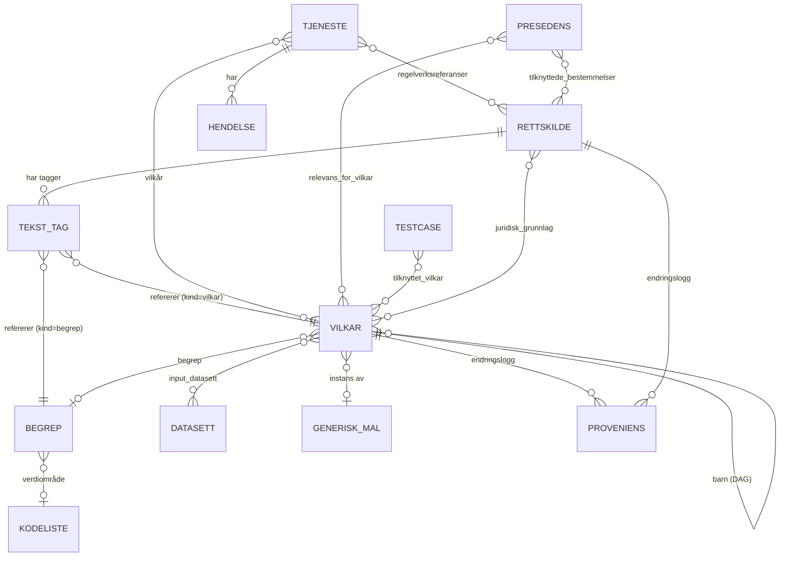
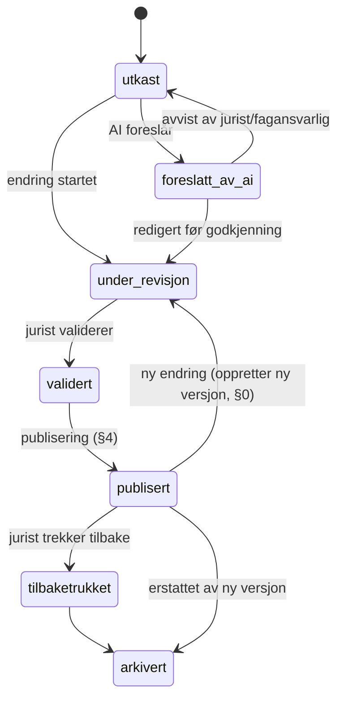
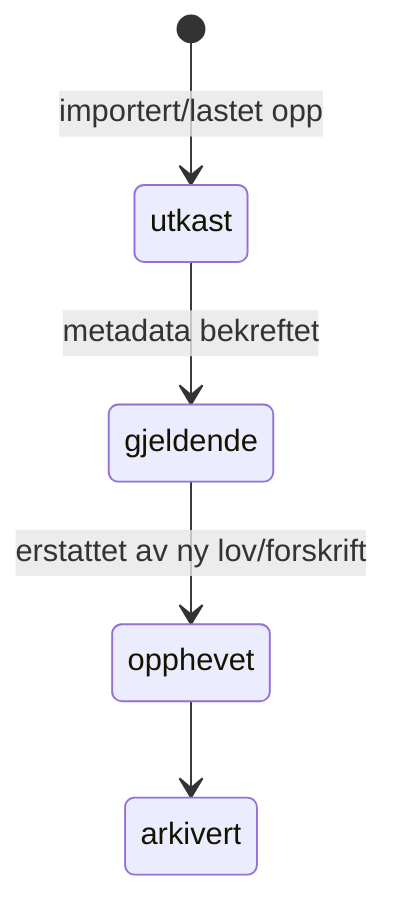

# Domenemodell — entiteter, relasjoner, RBAC, livssykluser, publisering

*Begrepene under er definert presist i [`01-referansemodell.md`](01-referansemodell.md); dette dokumentet er feltnivå-skjemaet. Skjermene som bruker disse entitetene er beskrevet i [`02-produktkrav.md`](02-produktkrav.md).*

## 0. Felles basemetadata

Alle entiteter i §1 arver følgende felt (samler den eksterne vurderingens punkt om "felles metadata i en felles basemodell"). De er ikke gjentatt per entitet under.

| Felt | Type | Beskrivelse |
|---|---|---|
| `id` | string | Stabil, unik identifikator, uforandret på tvers av versjoner |
| `versjon` | int | Se §3.10 i tidligere utkast — heltall, økende |
| `entitetsstatus` | enum | `gjeldende` / `erstattet` / `arkivert` |
| `erstatter` / `erstattes_av` | ref, nullable | Peker til forrige/neste versjon |
| `gyldig_fra` / `gyldig_til` | date, nullable | |
| `opprettet_av`, `opprettet_tidspunkt` | string, datetime | |
| `sist_endret_av`, `sist_endret_tidspunkt` | string, datetime | |

Proveniens (endringslogg) er en separat, append-only tabell — se §3.11 under.

## 1. Entiteter og relasjoner

### 1.1 Rettskilde
| Felt | Type | Beskrivelse |
|---|---|---|
| `doctype` | enum | `act` (lov/forskrift), `doc` (rundskriv), `judgment` (presedens), `internal` (virksomhetsdokument) |
| `kildetype` | enum | Lov, Forskrift, Rundskriv, Presedens, Virksomhetsdokument |
| `tittel`, `kortnavn` | string | |
| `eli` / `identifikator` | string | F.eks. `LOV-1989-06-02-27` |
| `aknXml` | text | Kanonisk AKN-representasjon |
| `ikrafttredelse`, `konsolidertDato` | date | |
| `utgiver` | string | F.eks. Lovdata |
| `status` | enum | Gjeldende / Opphevet / Utkast |
| `noder[]` | tre | Kapittel/paragraf/ledd/bokstav med `eId` |

Adresserbare enheter har `eId` (f.eks. `par_1-7b`). Presedens modelleres som AKN `judgment` (§1.7).

### 1.2 Tekst-tag
Kobler en tekstflate i en rettskilde til en modell-entitet, lagret som `<term>` i AKN.

| Felt | Type | Beskrivelse |
|---|---|---|
| `kildeId`, `eId` | string | Hvilken bestemmelse |
| `start`, `end` | int | Tegn-offset i normalisert tekst (posisjonsbasert — tillater overlappende tagger) |
| `quoteSelector` | string | **Nytt.** Sitatet selv (før/etter-kontekst + eksakt tekst), etter W3C Web Annotation-mønster. Se `05-arkitektur-og-nfk.md` §3 for hvorfor ren offset ikke er robust nok ved konsoliderte lovendringer og korrektur |
| `kind` | enum | `begrep` / `vilkar` / `regel` |
| `ref` | ref | ID til begrep/vilkår/regel (ny eller eksisterende) |

### 1.3 Begrep (SKOS)
| Felt | Type | Beskrivelse |
|---|---|---|
| `term` (`skos:prefLabel`) | string | |
| `definisjon` (`skos:definition`) | text | Egenformulert, kort |
| `lovreferanse` (`dct:source`) | eId | |
| `gjelder_for` | string[] | Roller/tjenester |
| `kodeliste_referanse` | ref, nullable | Peker til verdiområde (§1.4) |
| `skosUrl` | url | Publisert URI i Felles datakatalog (data.norge.no) |
| `skosType` | const | `skos:Concept` |
| `begrepstype` | enum | **Nytt.** `faktabegrep` / `handlingsbegrep`, jf. Schartum (2025) 7.3.3–7.3.4. Faktabegreper er relativt statiske (aktør/beslutningsgrunnlag/resultat); handlingsbegreper angir hva som skal gjøres (vilkårsprøving, beregning, informasjonsutveksling, sikkerhet) |

Samme begrep kan refereres fra flere vilkårsnoder uten duplisering. Ett begrepsuttrykk skal ha ett begrepsinnhold — unngå synonymer (Schartum 2025, 7.3.1).

### 1.4 Kodeliste / verdidomene
| Felt | Type | Beskrivelse |
|---|---|---|
| `type` | enum | `juridisk` / `teknisk` / `ekstern-referanse` |
| `juridisk_grunnlag` | eId | Kun `juridisk` |
| `ekstern_kilde` | uri + versjon | Kun `ekstern-referanse` |
| `koder[]` | liste | `{kode, term, definisjon, gyldig_fra, gyldig_til, erstattes_av}` |

**Tre typer verdidomener:**
- **Juridisk forankret** — eies/valideres av jurist (f.eks. `KL-VANDELSOMRADE`, `KL-RETTSKILDEVEKT`).
- **Teknisk/operasjonell** — eies av systemforvalter (f.eks. `KL-VILKARSUTFALL`, `KL-SAKSSTATUS`).
- **Ekstern autoritativ** — refereres, dupliseres ikke (f.eks. kommunenummer/SSB, organisasjonsnummer, Digdirs felles kodelister).

`KL-VILKARSUTFALL` (teknisk) har seks verdier: `oppfylt`, `ikke_oppfylt`, `krever_skjonn`, `krever_dokumentasjon`, `ukjent`, `ma_vurderes_av_jurist`.

### 1.5 Tjeneste (CPSV-AP-NO)
Felt: tittel, beskrivelse, kompetent myndighet, output, tjenestetype, målgruppe, kanaler, kostnad/gebyr, behandlingstid, språk, kontaktpunkt, konsekvens ved brudd, regelverksreferanser (`eId`-lenker), vilkår (ref til §1.8), **hendelser[]**, tjenesteavhengigheter[], status, versjon.

**Hendelse:** `{navn, type: Forretningshendelse/Innrapportering/Hendelse, trigger}`. Eksempler: søknad om bevilling, søknad om fornyelse, endringsmelding, årlig omsetningsoppgave, kontroll/tilsyn, vedtak om inndragning.

**Tjenesteavhengighet:** `{rel: før/avhengig av/input til, navn, kilde: intern tjeneste eller "eksternt oppslag · data.norge.no"}`. Dette er én relasjonstype i kunnskapsgrafen (kap. 3.13 i produktkrav), ikke en separat graf.

### 1.6 Datasett / datapunkt
Felt: `felt`/`prop` (visningsnavn/maskinnavn, f.eks. `styrer.fodselsdato`), `dtype` (string/integer/boolean/date/object), `type` (oppslagbart/brukeroppgitt/utledet), `kilde`, `vilkar` (kobling), `kodeliste` (der relevant), `grunnlag` (rettslig grunnlag for behandling/oppslag), `lagring` (lagringstid), `mottakere`, `bruk`.

### 1.7 Presedens (AKN `judgment`)
Felt: `saksnummer`, `dato`, `organ` (klagenemnd/statsforvalter/domstol), `utfall` (medhold/avslag/delvis medhold), `tilknyttede_bestemmelser[]` (`eId`), `relevans_for_vilkar[]`, `rettskildevekt` (fra `KL-RETTSKILDEVEKT` — aldri fritekst), `sammendrag`.

Presedens kan foreslå/begrunne tolkning av et vilkår, men blir **aldri automatisk bindende regelendring** — jurist/fagansvarlig avgjør.

### 1.8 Vilkår (regelnode) — under revisjon
Feltene under er kravspesifikasjonens opprinnelige, samlede node. **Se `01-referansemodell.md` §5** for forslaget om å dele denne i `Vilkår`/`Regel`/`Unntak`-nodetyper — feltlisten under vil endres når det avklares.

| Felt | Beskrivelse |
|---|---|
| `tittel`, `beskrivelse` | |
| `generisk_mal` | F.eks. `GM-VANDEL-PERSON` (to-lags modell, produktkrav kap. 4.1) |
| `vilkarstype` | **Nytt.** `formell` / `materiell`, jf. `01-referansemodell.md` §6 |
| `gjelder_rolle` | F.eks. bevillingshaver, styrer/stedfortreder |
| `juridisk_grunnlag[]` | `{kilde, eId}` |
| `begrep` | Referanse til begrep |
| `vurderingstype` | `regelbasert` / `skjonnsbasert` / `hybrid` |
| `parametre` | F.eks. `minimumsalder=20`, `kodeliste`-referanse |
| `barn[]` | Delvurderinger (hierarki) — **skal danne en DAG**, se §1.10 |
| `barn_operator` | `OG` / `ELLER` / `IKKE` (se `01-referansemodell.md` §3 for hvorfor ikke XOR/NAND) |
| `input_datasett[]` | Datapunkter brukt som input |
| `utdata_parameter` | `{navn, type}` — hva vilkåret produserer |
| `status` | Se livssyklus, §3 under |

**Skjønnsfelt** (for `skjonnsbasert`/`hybrid`): `skjonnsmomenter[]` (moment + kort beskrivelse + ev. presedensreferanse), `krever_dokumentasjon`, `eskaleringsrolle` (typisk jurist).

**Tekster (per vilkår):** veiledningstekst til bruker, veiledning til saksbehandler, innvilgelsestekst, avslagstekst, referanser til lovverk, gyldighetsperiode.

### 1.9 Generisk vilkårsmal
`{beskrivelse, vurderingstype, brukt_i_antall_tjenester}`. Instansieres flere ganger med ulikt omfang/lovreferanse.

### 1.10 DAG-krav for vilkårs-/regeltreet

Vilkårs-/regelgrafen (produktkrav kap. 3.4) **skal** være en rettet asyklisk graf (DAG):

- Enhver node (`barn[]`-relasjonen) skal ikke kunne nå seg selv via en kjede av barn-relasjoner.
- Systemet skal validere dette ved lagring (ikke bare i UI) — se AK-3.4.6 i produktkrav.
- Årsak: sykler gir udefinert oppførsel ved evaluering, eksport (DMN/eFLINT krever DAG), testkjøring og påvirkningsanalyse (kunnskapsgraf, kap. 3.13).
- Datasett-noder (§1.6) er alltid blad-input, aldri mål for en kant fra en vilkårsnode — informasjonsflyten er strengt input → vilkår → vedtak.

### 1.11 Testcase
Felt: `tilknyttet_vilkar[]`, `input` (eksempeldata), `forventet_resultat` (verdi fra `KL-VILKARSUTFALL`), `forventet_forklaring` (kort forventet begrunnelsestekst), `juridisk_grunnlag`.

### 1.12 Proveniens / endringslogg (append-only, atskilt fra versjonering)
Versjonering (§0) svarer «hvilken versjon gjelder»; proveniens svarer «hvordan ble denne versjonen til».

| Felt | Beskrivelse |
|---|---|
| `endret_av` | Person/rolle |
| `dato` | |
| `handling` | opprettet / endret / foreslått_av_ai / validert / publisert / arkivert |
| `kilde_referanser[]` | `eId`, rundskriv-avsnitt, presedens-noder |
| `ai_forslag_versjon` | nullable |
| `godkjent_av` | nullable — jurist/fagansvarlig |

### 1.13 ER-diagram (relasjoner mellom hovedentitetene)

---

## 2. Rolle- og autorisasjonsmodell (RBAC)

| Handling | Fagansvarlig | Jurist | Systemforvalter | Saksbehandler | AI-assistent |
|---|---|---|---|---|---|
| Opprette/endre rettskilde (import) | ✓ | ✓ | | | |
| Opprette/endre begrep | ✓ | ✓ | | | |
| Opprette vilkår (utkast) | ✓ | ✓ | | | Foreslå (status `foreslått av AI`) |
| Endre vilkår | ✓ | ✓ | | | |
| Validere vilkår/AI-forslag | | ✓ | | | |
| Publisere vilkår/tjeneste | | ✓ | | | |
| Endre juridiske kodelister | | ✓ | | | |
| Endre tekniske kodelister | | | ✓ | | |
| Referere ekstern autoritativ kodeliste | ✓ | ✓ | ✓ | | |
| Opprette presedens | ✓ | ✓ | | | |
| Kjøre påvirkningsanalyse | ✓ | ✓ | ✓ | | |
| Godkjenne testcase-kjøring før publisering | | ✓ | | | |
| Bruke saksbehandlingsverktøy | | | | ✓ | |
| Overstyre saksutfall (med begrunnelse) | | | | ✓ | |
| Bytte rolle (rollevelger) | ✓ | ✓ | ✓ | ✓ | — |

Prinsipp: **AI-assistenten har ingen rad med ✓ utenom "foreslå"** — den kan aldri validere, publisere eller overstyre, jf. `digital-rettsstat` prinsipp 4 og AK-3.10.1 i produktkrav.

---

## 3. Livssykluser

### 3.1 Vilkår / Regel

Samme mønster (utkast → under revisjon → validert → publisert → tilbaketrukket/arkivert) gjelder for **rettskilder**, **tjenester** og **kodelister**, med ett unntak: eksterne autoritative kodelister (§1.4) har ikke `publisert`-steget — de er alltid `gjeldende` så lenge kilden de refererer til er det.

### 3.2 Rettskilde

---

## 4. Publiseringsmodell

Svarer på den eksterne vurderingens spørsmål: hva publiseres, er det atomisk, kan det rulles tilbake?

- **Publiseringsenhet er ett vilkår/én regelnode**, ikke hele tjenesten og ikke hele regelsettet. Å publisere en tjeneste betyr at *alle* dens vilkårsnoder med status `validert` blir `publisert` i samme transaksjon — men et enkeltvilkår kan publiseres uavhengig av søsken-nodene sine, så lenge grafen fortsatt er en gyldig DAG uten referanser til upubliserte noder fra publiserte noder.
- **Publisering er atomisk per enhet**: et vilkår går fra `validert` til `publisert` i én transaksjon som (a) låser feltverdiene for den versjonen, (b) skriver en proveniens-rad, (c) trigger domenehendelsen `RulePublished` (§5), og (d) kjører berørte testcaser (AK-3.15.1) — publisering feiler og rulles tilbake som helhet hvis testcaser ikke er godkjent.
- **En publisert node skal aldri redigeres i-place.** En endring etter publisering oppretter en ny versjon (`erstatter`-kjeden i §0); den gamle versjonen forblir lesbar og er hva historiske vedtak fortsatt peker på (jf. `forklaringsmodell-api`s append-only-prinsipp).
- **Rollback** = trekke tilbake (`tilbaketrukket`), ikke slette. En tilbaketrukket node kan ikke lenger brukes i nye evalueringer, men forblir i historikken for spor tilbake fra eksisterende vedtak.
- **En regelnode kan ikke publiseres før alle dens `barn[]` enten er `publisert` eller eksplisitt markert som ikke påkrevd** (f.eks. en alternativ/ELLER-gren som ikke er ferdigstilt ennå skal blokkere publisering av foreldrenoden, ikke stille inn).

---

## 5. Hendelsesmodell (domenehendelser)

| Hendelse | Utløses av | Nyttelast (minimum) |
|---|---|---|
| `SourceImported` | Ny rettskilde lagt til biblioteket (AK-3.3.5–3.3.7) | `rettskildeId`, `eli`, `importmetode` |
| `ConceptChanged` | Begrep opprettet/endret/publisert | `begrepId`, `endringstype`, `nyVersjon` |
| `AIProposalApproved` | AI-forslag godkjent (AK-3.10.2) | `forslagId`, `vilkarId`, `godkjentAv` |
| `RulePublished` | Vilkår/regel publisert (§4) | `vilkarId`, `versjon`, `publisertAv`, `tidspunkt` |
| `RuleArchived` | Vilkår/regel arkivert eller tilbaketrukket | `vilkarId`, `versjon`, `arsak` |
| `SourceAmended` | En publisert rettskildes `eId` får ny versjon | `rettskildeId`, `eId`, `gammelVersjon`, `nyVersjon` — **utløser lovspeil-varsel** til alle vilkår som refererer `eId` (se `07-forklaringsmodell-api-avvik.md`) |

Disse hendelsene er input til kunnskapsgrafens påvirkningsanalyse (produktkrav kap. 3.13) og til dashbordets aktivitetsgraf (produktkrav kap. 3.1). De skal logges append-only, samme mønster som proveniensen i §1.12.
