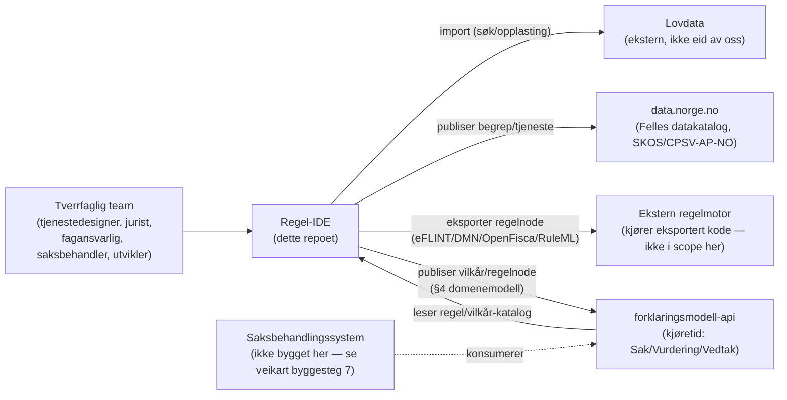

# Arkitektur og ikke-funksjonelle krav

## 0. Systemkontekst

Regel-IDE er *forfatterverktøyet*. Lovdata og data.norge.no er eksterne systemer vi kun leser fra/skriver til via kjente grensesnitt (søk/opplasting, SKOS/CPSV-AP-NO-publisering) — vi eier ingen del av dem. Regelmotoren som faktisk kjører den eksporterte koden (DMN-motor, eFLINT-tolk osv.) er eksplisitt utenfor scope (jf. `02-produktkrav.md` kap. 8). `forklaringsmodell-api` er den eneste integrasjonen vi både leser fra og skriver til som del av vår egen leveranse — se §3.5 under og `07-forklaringsmodell-api-avvik.md` for detaljene.

## 1. Teknologivalg

- **Frontend:** React + TypeScript. Komponenter og tokens fra Designsystemet (`@digdir/designsystemet-react`, `-css`, `-theme`) — se `02-produktkrav.md` kap. 6 for det bindende designsystemkravet.
- **Rettskildeformat:** Akoma Ntoso (AKN) som kanonisk lagringsformat for lov/forskrift/rundskriv/presedens, i tråd med `digital-rettsstat`s Kildelag-anbefaling (nasjonal profil "AKN-NO", jf. `digital-rettsstat/docs/07-standarder-og-sporbarhetskjeden.md`).
- **Vilkårs-/regelgraf:** skal lagres som en egen, versjonert graf-struktur (ikke kun avledet fra AKN), fordi den skal kunne valideres som DAG (`03-domenemodell.md` §1.10) uavhengig av tekstrepresentasjonen.
- **Regeleksport:** eFLINT, OpenFisca, DMN, RuleML — via mellomformat. Dette er identisk med `digital-rettsstat`s formatvalg (DMN/FLINT/OpenFisca/NRML), med to navnenyanser å avklare — se `07-forklaringsmodell-api-avvik.md`.
- **Begreper:** SKOS, publisert til Felles datakatalog (data.norge.no).
- **Tjeneste:** CPSV-AP-NO.
- **Backend:** Ikke låst i v0.1. `forklaringsmodell-api` er bygget i ASP.NET Core/.NET 8 — å bruke samme stack for regel-ide sitt eget API senker terskelen for å dele DTO-er/valideringslogikk mellom de to, men er ikke en forutsetning. Avklares i fase 1 (se `06-veikart.md`).

## 2. Ikke-funksjonelle krav

- **Tilgjengelighet (WCAG 2.1 AA):** se `02-produktkrav.md` kap. 7 for de brukervendte kravene.
- **Ytelse:** lister/grafer skal håndtere realistiske volum (hundrevis av vilkår, tusenvis av vedtak) med paginering/virtualisering. Kunnskapsgrafens påvirkningsanalyse (produktkrav kap. 3.13) skal svare innen få sekunder for grafer i denne størrelsesordenen — legg ikke opp til at hele grafen lastes klientsidig ved hvert oppslag.
- **Sporbarhet:** all endring av sentrale entiteter skal skrives til proveniens (`03-domenemodell.md` §1.12) og trigge riktig domenehendelse (§5). Dette er samme ufravikelige krav som `digital-rettsstat` prinsipp 2 og `forklaringsmodell-api`s append-only-prinsipp.
- **Reproduserbarhet:** et historisk vedtak skal kunne rekonstrueres presist fra de eksakte entitetsversjonene som gjaldt (point-in-time, jf. `digital-rettsstat/docs/07-standarder-og-sporbarhetskjeden.md`).
- **Interoperabilitet:** AKN for rettskilder, SKOS for begreper, CPSV-AP-NO for tjeneste, JSON Schema for informasjonsmodell.
- **Samtidig redigering / konfliktløsning:** flere brukere kan ha samme rettskilde eller vilkårstre åpent samtidig. v0.1 krever ikke sanntids samskriving (som LEOS har for lovtekst), men **skal** varsle og avvise en lagring som ville overskrevet en endring gjort av en annen bruker etter at gjeldende bruker sist lastet dataene (optimistic concurrency på `versjon`-feltet i basemetadata, `03-domenemodell.md` §0).
- **Backup/gjenoppretting:** ikke spesifisert i detalj her — arves av valgt driftsplattform, men append-only-prinsippet (over) betyr at en gjenoppretting aldri kan tape en publisert versjon uten at det er synlig i proveniensen.

## 3. Tekniske risikoområder

### 3.1 Tagging av rettskilder som tegnintervaller er sårbart
`start`/`end`-offset (`03-domenemodell.md` §1.2) er sårbare ved konsoliderte lovendringer, korrektur og ny import — teksten kan skifte selv om paragrafen ikke endres i sak. **Tiltak:** lagre i tillegg `eId` (allerede i modellen), og et `quoteSelector` (sitatet + kontekst før/etter), etter mønster fra W3C Web Annotation. Ved reimport/konsolidering skal systemet forsøke å relokere tagger via `quoteSelector` før det faller tilbake til offset, og flagge tagger som ikke kan relokeres automatisk for manuell gjennomgang.

### 3.2 Vilkårsmodellen skal formelt kreve DAG
Se `03-domenemodell.md` §1.10. Både backend (ved lagring) og frontend (ved forsøk på å koble en node) skal validere dette — ikke bare én av dem.

### 3.3 Logiske operatorer
Se `01-referansemodell.md` §3 for hvorfor operatorsettet er redusert til OG/ELLER/IKKE (+ sammenligningsoperatorer på datapunkt-nivå), med begrunnelse fra Schartum (2025) og `digital-rettsstat`s eksportformater.

### 3.4 Hendelsesmodell
Se `03-domenemodell.md` §5 for domenehendelsene. Disse bør publiseres på en meldingskø/event-buss (valg av teknologi ikke låst i v0.1) slik at kunnskapsgrafens påvirkningsanalyse og et fremtidig lovspeil-varslingssystem (`07-forklaringsmodell-api-avvik.md`) kan konsumere dem uavhengig av hovedapplikasjonen.

**Bevisst utsatt, ikke glemt: publiseringsarkitektur.** Hendelsesmodellen (§5 i domenemodellen) og publiseringsmodellen (§4 der) beskriver *hva* som skal skje ved publisering og *hvilke* hendelser det skal gi — de beskriver bevisst **ikke** *hvordan* dette realiseres teknisk (event sourcing? CQRS? transaksjonsgrenser i én relasjonsdatabase med et outbox-mønster for hendelsene?). Det er en implementasjonsbeslutning for når byggesteg 1 (`06-veikart.md`) faktisk starter koding, ikke noe en kravspesifikasjon bør låse før det finnes reell last- eller konsistensdata å basere valget på. En enkel outbox-tabell i samme database som resten av modellen dekker kravene i §4/§5 fint til å begynne med; full CQRS/event sourcing er en skaleringsoptimalisering å vurdere senere, ikke en forutsetning.

### 3.5 Grensen mellom regel-IDE og forklaringsmodell-api
Regel-IDE er *forfatterverktøyet* (Lag 1–2, jf. `digital-rettsstat`); `forklaringsmodell-api` er (deler av) *kjøretiden* (Lag 3–4 + tverrgående sporbarhet). Grensesnittet mellom dem er ikke ferdig spesifisert: når en Vilkår- eller Regelnode publiseres i regel-IDE (§4 i `03-domenemodell.md`), må den på et tidspunkt bli en `Regel`- og/eller `Vilkar`-rad i `forklaringsmodell-api`s skjema (merk navnekollisjonen — regel-IDEs `/api/regelnoder`, ikke `/api/vilkar`, er det som til slutt blir en `forklaringsmodell-api`-`Regel`-rad, se `01-referansemodell.md` §5.6). Om dette skjer ved eksport-fil + manuell registrering, eller ved at regel-IDE kaller `forklaringsmodell-api`s `/api/regler`/`/api/vilkar`-endepunkter direkte ved publisering, er ikke avgjort — se `07-forklaringsmodell-api-avvik.md` §3.
