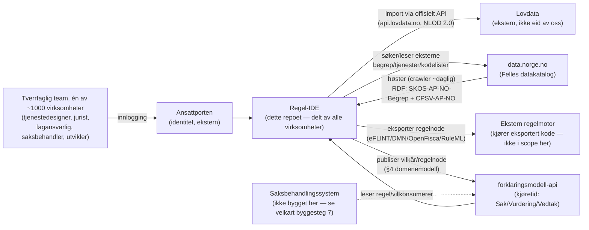

# Arkitektur og ikke-funksjonelle krav

## 0. Systemkontekst

Regel-IDE er *forfatterverktøyet*. **Viktig presisering (rettet etter produkteiers innspill):** vi kan ikke "publisere til" data.norge.no — Felles datakatalog fungerer utelukkende ved at den **høster** (crawler) fra registrerte, offentlig tilgjengelige endepunkter, typisk én gang i døgnet. "Publisere" i regel-IDEs egen domenemodell (§4 i `03-domenemodell.md`) betyr derfor: gjøre et begrep/en tjeneste tilgjengelig i regel-IDEs **eget** høstbare RDF-endepunkt — se §1 og §3.6 under. Det vi faktisk gjør *mot* data.norge.no er lesing/søk (for eksterne referanser, `02-produktkrav.md` kap. 3.2/3.4/3.7). Regelmotoren som faktisk kjører den eksporterte koden (DMN-motor, eFLINT-tolk osv.) er eksplisitt utenfor scope (jf. `02-produktkrav.md` kap. 8). `forklaringsmodell-api` er den eneste integrasjonen vi både leser fra og skriver til som del av vår egen leveranse — se §3.5 under og `07-forklaringsmodell-api-avvik.md` for detaljene.

## 1. Teknologivalg

- **Frontend:** React + TypeScript. Komponenter og tokens fra Designsystemet (`@digdir/designsystemet-react`, `-css`, `-theme`) — se `02-produktkrav.md` kap. 6 for det bindende designsystemkravet.
- **Rettskildeformat:** Akoma Ntoso (AKN) som kanonisk lagringsformat for lov/forskrift/rundskriv/presedens, i tråd med `digital-rettsstat`s Kildelag-anbefaling (nasjonal profil "AKN-NO", jf. `digital-rettsstat/docs/07-standarder-og-sporbarhetskjeden.md`).
- **Vilkårs-/regelgraf:** skal lagres som en egen, versjonert graf-struktur (ikke kun avledet fra AKN), fordi den skal kunne valideres som DAG (`03-domenemodell.md` §1.10) uavhengig av tekstrepresentasjonen.
- **Regeleksport:** eFLINT, OpenFisca, DMN, RuleML — via mellomformat. Dette er identisk med `digital-rettsstat`s formatvalg (DMN/FLINT/OpenFisca/NRML), med to navnenyanser å avklare — se `07-forklaringsmodell-api-avvik.md`.
- **Begreper:** SKOS, publisert til Felles datakatalog (data.norge.no).
- **Tjeneste:** CPSV-AP-NO.
- **Backend:** **Låst ved byggestart (2026-07-23): ASP.NET Core/.NET 8** — samme stack som `forklaringsmodell-api`, senker terskelen for å dele DTO-er/valideringslogikk mellom de to. Implementert: `RegelIde.Kildekonvertering` (konverteringspipeline), `RegelIde.Data` (EF Core + PostgreSQL), `RegelIde.Api` (les-API), se `src/README.md`.
- **RDF-serialisering:** trengs for høsting mot data.norge.no (§1.2 under) — f.eks. `dotNetRDF`. Ikke gjort ennå (byggesteg 2+, når Begrep/Tjeneste finnes).
- **Database:** PostgreSQL (Npgsql/EF Core), skjemaet i `08-byggesteg1-teknisk-design.md` §2. **Flervirksomhet fra v0.3** (se `00-endringslogg-v0.3.md`): én delt database for opptil ~1000 virksomheter, med `virksomhet_id` på virksomhetseide entiteter (§0.1 i `03-domenemodell.md`) — ikke én database per virksomhet, av driftskostnadshensyn.
- **Identitet/innlogging:** **Ansattporten** (låst i v0.3). Virksomhetstilhørighet avledes fra Ansattporten-claims ved innlogging — nøyaktig hvilket claim (organisasjonsnummer → `virksomhet_id`) og hvordan en ny virksomhet/dens første brukere provisjoneres i regel-IDE, er **ikke spesifisert i detalj ennå**, se `00-endringslogg-v0.3.md`.

### 1.1 Import fra Lovdata

Lovdata har et offisielt, gratis API for gjeldende lover og sentrale forskrifter under **NLOD 2.0**-lisens (åpen, krever kun kildeangivelse), eksplisitt lansert "tilpasset [...] KI-hverdag". Import-funksjonen (kap. 3.3 i produktkrav, AK-3.3.5) **skal** bruke `api.lovdata.no` direkte:

- **Strukturerte endepunkter** (`renderRefID`, `documentIndex`, `documentHistory`, `v1/search`, `v1/structuredRules/*`) krever API-nøkkel (X-API-Key/Basic Auth) — registrering hos Lovdata er en forutsetning før importfunksjonen kan bygges ferdig.
- **To gratis bulk-datasett uten autentisering** dekker det vi trenger for enkeltimport av en gitt lov/forskrift i mellomtiden: `v1/publicData/get/gjeldende-lover.tar.bz2` og `.../gjeldende-sentrale-forskrifter.tar.bz2` (hhv. ~5,8 MB og ~20 MB komprimert, alle gjeldende lover/sentrale forskrifter). Filene er navngitt `nl/nl-ÅÅÅÅMMDD-NNN.xml` / `sf/sf-ÅÅÅÅMMDD-NNN.xml` etter dato+løpenummer i datokoden (f.eks. alkoholloven LOV-1989-06-02-27 → `nl-19890602-027.xml`).
- **Filformat:** "XML-kompatibel HTML", **cp1252-kodet** (ikke UTF-8/latin-1 — viktig å håndtere riktig ved import, ellers blir æøå korrupt). Strukturen er allerede nesten AKN-klar: `<section class="section" data-name="kap1">` = kapittel, `<article class="legalArticle" data-lovdata-URL=".../§4-3" data-name="§4-3">` = paragraf, nøstet `<article class="legalP">` = ledd, `<li><article class="listArticle">` = bokstav-/nummerpunkt. `data-lovdata-URL` er praktisk talt en ferdig hierarkisk identifikator regel-IDEs `eId` kan avledes direkte fra. Kryssreferanser mellom paragrafer er allerede `<a href="lov/.../§X">`.
- **Konvertering til AKN — presisert etter å ha sett ekte data (kap. 3.3, AK-3.3.6):** for Lovdata-kildet innhold er dette en **deterministisk, regelbasert transformasjon**, ikke en LLM-oppgave — strukturen (`section`/`legalArticle`/`legalP`/`data-lovdata-URL`) er allerede fullt maskinlesbar, og en LLM ville innføre unødvendig ikke-determinisme der en ren HTML-parser holder. Se `08-byggesteg1-teknisk-design.md` for full pipeline. **AI-assistert konvertering forbeholdes opplastede, ustrukturerte dokumenter** (rundskriv, virksomhetsdokument) — der finnes ingen `data-lovdata-URL`-ekvivalent, og strukturgjenkjenning er en reell tolkningsoppgave. Begge veier ender i status `utkast` (jf. livssyklusen, `03-domenemodell.md` §3.2), verifisert av jurist/fagansvarlig mot kildeteksten i side-ved-side-visningen (AK-3.3.6) før `gjeldende` — for Lovdata-sporet er oppgaven å fange parserfeil, for opplastet dokument å vurdere en reell tolkning. Vurder OCR som forsteg for skannede PDF-er.
- **Attribusjon:** all bruk skal oppgi Lovdata som kilde, jf. NLOD 2.0 — dette bør skje automatisk (f.eks. i `utgiver`-feltet, `03-domenemodell.md` §1.1, og i eksportert AKN-metadata), ikke som en manuell påminnelse til brukeren.

### 1.2 Publisering mot data.norge.no (Felles datakatalog) — høsting, ikke push

Felles datakatalog **høster** (crawler, typisk én gang i døgnet) fra registrerte, offentlig tilgjengelige endepunkter — den mottar ingen direkte "publiser"-kall. Kravene for høsting:

1. Beskrivelsen må følge **DCAT-AP-NO** (datasettnivå), og de aktuelle profilene for våre entiteter: **SKOS-AP-NO-Begrep** for begreper (kap. 3.8 i produktkrav) og **CPSV-AP-NO** for tjenester (kap. 3.2).
2. Filen som høstes må være **offentlig tilgjengelig på internett uten autentisering**.
3. Filen må være gyldig **RDF** — Turtle eller JSON-LD.
4. Organisasjonen (Testkommunen, se `02-produktkrav.md` kap. 2) må ha **Altinn-autorisert tilgang** til å registrere endepunktet i data.norge.nos registreringsløsning — dette er en **engangsregistrering på organisasjonsnivå**, ikke noe regel-IDE gjør per entitet.

Konsekvens for domenemodellen (`03-domenemodell.md` §4): når et Begrep/en Tjeneste settes til `publisert`, betyr det at den nå inngår i regel-IDEs **egne**, offentlig eksponerte RDF-endepunkter (`04-api-kontrakter.md` — nye endepunkter for dette). Selve synligheten på data.norge.no skjer asynkront, ved neste høsting (opptil ett døgn senere) — ikke i publiseringstransaksjonen. `skosUrl`-feltet (`03-domenemodell.md` §1.3) fylles derfor ut *etter* første vellykkede høsting, ikke ved publisering.

**Lesing/søk mot data.norge.no** (for eksterne referanser, kap. 3.2/3.4/3.7 i produktkrav) er en separat, enklere integrasjon: et vanlig utgående søke-/oppslagskall mot data.norge.nos egne API-er — ingen registrering eller RDF-eksponering kreves for dette, kun for publisering.

## 2. Ikke-funksjonelle krav

- **Tilgjengelighet (WCAG 2.1 AA):** se `02-produktkrav.md` kap. 7 for de brukervendte kravene.
- **Ytelse:** lister/grafer skal håndtere realistiske volum (hundrevis av vilkår, tusenvis av vedtak) med paginering/virtualisering. Kunnskapsgrafens påvirkningsanalyse (produktkrav kap. 3.13) skal svare innen få sekunder for grafer i denne størrelsesordenen — legg ikke opp til at hele grafen lastes klientsidig ved hvert oppslag.
- **Sporbarhet:** all endring av sentrale entiteter skal skrives til proveniens (`03-domenemodell.md` §1.12) og trigge riktig domenehendelse (§5). Dette er samme ufravikelige krav som `digital-rettsstat` prinsipp 2 og `forklaringsmodell-api`s append-only-prinsipp.
- **Reproduserbarhet:** et historisk vedtak skal kunne rekonstrueres presist fra de eksakte entitetsversjonene som gjaldt (point-in-time, jf. `digital-rettsstat/docs/07-standarder-og-sporbarhetskjeden.md`).
- **Interoperabilitet:** AKN for rettskilder, SKOS for begreper, CPSV-AP-NO for tjeneste, JSON Schema for informasjonsmodell.
- **Samtidig redigering / konfliktløsning:** flere brukere kan ha samme rettskilde eller vilkårstre åpent samtidig. v0.1 krever ikke sanntids samskriving (som LEOS har for lovtekst), men **skal** varsle og avvise en lagring som ville overskrevet en endring gjort av en annen bruker etter at gjeldende bruker sist lastet dataene (optimistic concurrency på `versjon`-feltet i basemetadata, `03-domenemodell.md` §0). **Implementert** (EF Core concurrency token på `rettskilder.versjon`, `RegelIde.Data`) — bekreftet mot ekte Postgres i test (`RettskildeImportTjenesteTests.Samtidig_skriving_pa_samme_rettskilde_avvises_ikke_stille`).
- **Lesetilgang er åpne data, ikke virksomhets-lukket (presisert 2026-07-24, se `00-endringslogg-v0.3.md`).** Rettskildebiblioteket (og senere Begrep/Tjeneste, jf. den eksisterende publiseringsfilosofien i §1.2 under) er ment å være offentlig lesbart uten innlogging, akkurat som en nasjonal åpne-data-katalog — ikke gjemt bak virksomhetstilhørighet. Det reelle skillet er **status**, ikke virksomhet: kun entiteter som ikke lenger er `Utkast` (ikke-verifiserte kladder, §3.1 steg 10 i teknisk design) er synlige, uansett hvilken virksomhet som eier dem. `RegelIde.Api` håndhever dette (filtrert på `Status`, med en valgfri `virksomhetId`-parameter for å snevre inn til én virksomhets bidrag — ikke en tilgangssperre). **Skriving** (opprette/endre — ikke bygget som API ennå) er derimot virksomhets- og rollebundet fra dag én (RBAC, `03-domenemodell.md` §2) og *vil* trenge autentisering (Ansattporten) den dagen skriveendepunkter bygges — det er kun lesesiden som er bevisst åpen.
- **Backup/gjenoppretting:** ikke spesifisert i detalj her — arves av valgt driftsplattform, men append-only-prinsippet (over) betyr at en gjenoppretting aldri kan tape en publisert versjon uten at det er synlig i proveniensen.

## 3. Tekniske risikoområder

### 3.1 Tagging av rettskilder som tegnintervaller er sårbart
`start`/`end`-offset (`03-domenemodell.md` §1.2) er sårbare ved konsoliderte lovendringer, korrektur og ny import — teksten kan skifte selv om paragrafen ikke endres i sak. **Tiltak:** lagre i tillegg `eId` (allerede i modellen), og et `quoteSelector` (sitatet + kontekst før/etter), etter mønster fra W3C Web Annotation. Ved reimport/konsolidering skal systemet forsøke å relokere tagger via `quoteSelector` før det faller tilbake til offset, og flagge tagger som ikke kan relokeres automatisk for manuell gjennomgang.

### 3.2 Vilkårsmodellen skal formelt kreve DAG
Se `03-domenemodell.md` §1.10. Både backend (ved lagring) og frontend (ved forsøk på å koble en node) skal validere dette — ikke bare én av dem.

### 3.3 Logiske operatorer
Se `01-referansemodell.md` §3 for hvorfor operatorsettet er redusert til OG/ELLER/IKKE (+ sammenligningsoperatorer på datapunkt-nivå), med begrunnelse fra Schartum (2025) og `digital-rettsstat`s eksportformater.

### 3.4 Hendelsesmodell
Se `03-domenemodell.md` §5 for domenehendelsene. Disse bør publiseres på en meldingskø/event-buss (valg av teknologi ikke låst i v0.1) slik at kunnskapsgrafens påvirkningsanalyse og et fremtidig lovspeil-varslingssystem (`07-forklaringsmodell-api-avvik.md`) kan konsumere dem uavhengig av hovedapplikasjonen.

**Bevisst utsatt, ikke glemt: publiseringsarkitektur.** Hendelsesmodellen (§5 i domenemodellen) og publiseringsmodellen (§4 der) beskriver *hva* som skal skje ved publisering og *hvilke* hendelser det skal gi — de beskriver bevisst **ikke** *hvordan* dette realiseres teknisk (event sourcing? CQRS? transaksjonsgrenser i én relasjonsdatabase med et outbox-mønster for hendelsene?). Det er en implementasjonsbeslutning for når byggesteg 1 (`06-veikart.md`) faktisk starter koding, ikke noe en kravspesifikasjon bør låse før det finnes reell last- eller konsistensdata å basere valget på. En enkel outbox-tabell i samme database som resten av modellen dekker kravene i §4/§5 fint til å begynne med; full CQRS/event sourcing er en skaleringsoptimalisering å vurdere senere, ikke en forutsetning.

### 3.5 Grensen mellom regel-IDE og forklaringsmodell-api
Regel-IDE er *forfatterverktøyet* (Lag 1–2, jf. `digital-rettsstat`); `forklaringsmodell-api` er (deler av) *kjøretiden* (Lag 3–4 + tverrgående sporbarhet). Grensesnittet mellom dem er ikke ferdig spesifisert: når en Vilkår- eller Regelnode publiseres i regel-IDE (§4 i `03-domenemodell.md`), må den på et tidspunkt bli en `Regel`- og/eller `Vilkar`-rad i `forklaringsmodell-api`s skjema (merk navnekollisjonen — regel-IDEs `/api/regelnoder`, ikke `/api/vilkar`, er det som til slutt blir en `forklaringsmodell-api`-`Regel`-rad, se `01-referansemodell.md` §5.6). Om dette skjer ved eksport-fil + manuell registrering, eller ved at regel-IDE kaller `forklaringsmodell-api`s `/api/regler`/`/api/vilkar`-endepunkter direkte ved publisering, er ikke avgjort — se `07-forklaringsmodell-api-avvik.md` §3.
